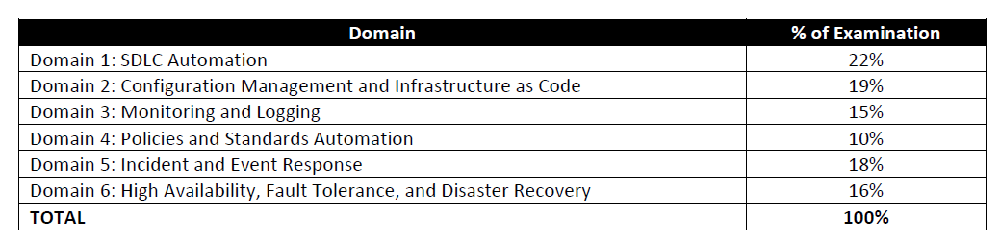

# aws-devops-professional

An overview of the exam:

* Exam Name: AWS Certified DevOps Engineer-Professional.
* Exam Type: Multiple Choice, Multiple Answer Questions.
* Exam Duration: 170 Minutes.
* Exam Fees: 300 USD

# Outline

## Preparation
### Whitepaper 
https://d1.awsstatic.com/whitepapers/AWS_Blue_Green_Deployments.pdf
https://d1.awsstatic.com/whitepapers/AWS_DevOps.pdf
https://d1.awsstatic.com/whitepapers/aws-development-test-environments.pdf
https://d1.awsstatic.com/whitepapers/DevOps/import-windows-server-to-amazon-ec2.pdf
https://d1.awsstatic.com/whitepapers/DevOps/infrastructure-as-code.pdf