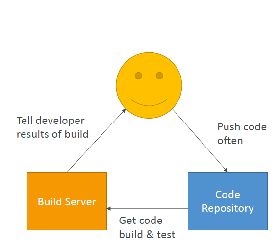
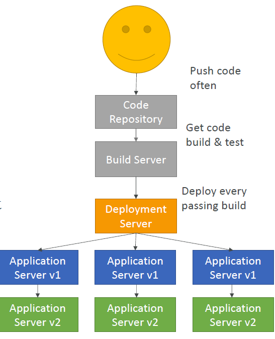

# SDLC Automation

## CI

### Code Commit
https://docs.aws.amazon.com/codecommit/latest/userguide/how-to-notify-lambda.html
### Code Build
https://docs.aws.amazon.com/codebuild/latest/userguide/welcome.html
#### Build Spec
https://docs.aws.amazon.com/codebuild/latest/userguide/build-spec-ref.html
#### Build Spec Docker
https://docs.aws.amazon.com/codebuild/latest/userguide/sample-docker.html
#### AWS Devops Blog
https://aws.amazon.com/blogs/devops/validating-aws-codecommit-pull-requests-with-aws-codebuild-and-aws-lambda/

#### Code Deploy
https://docs.aws.amazon.com/codedeploy/latest/userguide/reference-appspec-file-structure-hooks.html#appspec-hooks-ecs
[Continuous Delivery](images/hook.PNG)

## CD

Lifecycle event name	In-place deployment¹	Blue/green deployment: Original instances	Blue/green deployment: Replacement instances	Blue/green deployment rollback: Original instances	Blue/green deployment rollback: Replacement instances
ApplicationStop	✓		✓		
DownloadBundle²	✓		✓		
BeforeInstall	✓		✓		
Install²	✓		✓		
AfterInstall	✓		✓		
ApplicationStart	✓		✓		
ValidateService	✓		✓		
BeforeBlockTraffic	✓	✓			✓
BlockTraffic²	✓	✓			✓
AfterBlockTraffic	✓	✓			✓
BeforeAllowTraffic	✓		✓	✓	
AllowTraffic²	✓		✓	✓	
AfterAllowTraffic	✓		✓	✓	
¹Also applies to the rollback of an in-place deployment.

² Reserved for CodeDeploy operations. Cannot be used to run scripts.

Run order of hooks in a deployment